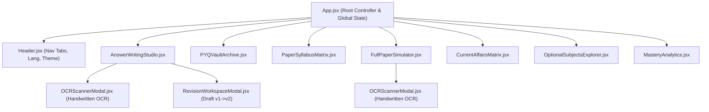

# YuktiPrep Mains 360° — Component API Reference & Data Dictionary

**Document Code:** YUKTI-REF-COMP-DATA  
**Version:** 2026.1  
**Classification:** Frontend Component API & Data Schema Reference  

---

## 1. React Component Hierarchy

---

## 2. Component API Reference

### 2.1 `<App />` (`src/App.jsx`)
* **Role:** Root application component orchestrating active tabs, global language, theme, and inter-tab navigation.
* **Global States:**
  * `activeTab: string` (`"studio"` | `"archive"` | `"syllabus"` | `"simulator"` | `"current-affairs"` | `"optionals"` | `"analytics"`)
  * `selectedQuestionId: string` (Default: `"pyq-2024-gs2-01"`)
  * `language: string` (`"en"` | `"hi"`)
  * `theme: string` (`"dark"` | `"light"`)

---

### 2.2 `<Header />` (`src/components/Header.jsx`)
* **Role:** Navigation bar with brand logo, tab buttons, bilingual switch, and light/dark theme toggle.
* **Props:**
  * `activeTab: string` (Current tab identifier)
  * `setActiveTab: Function` (Tab update handler)
  * `language: string` (`"en"` | `"hi"`)
  * `setLanguage: Function` (Toggle language)
  * `theme: string` (`"dark"` | `"light"`)
  * `setTheme: Function` (Toggle theme)

---

### 2.3 `<AnswerWritingStudio />` (`src/components/AnswerWritingStudio.jsx`)
* **Role:** Primary answer writing workspace with countdown timer, word limit ceiling, sample answer loaders, evaluation dashboard, and modal triggers.
* **Props:**
  * `selectedQuestionId: string` (Active question ID)
  * `setSelectedQuestionId: Function` (Change active question)
  * `language: string` (`"en"` | `"hi"`)
* **Internal States:**
  * `inputText: string` (Candidate answer draft)
  * `timeLeft: number` (Seconds remaining on timer)
  * `isTimerRunning: boolean`
  * `isEvaluating: boolean`
  * `evaluationResult: Object | null` (360° Board evaluation output)
  * `activeEvalTab: string` (`"risk_audit"` | `"where_missed"` | `"how_to_fix"` | `"pillars_radar"` | `"sme_feedback"`)
  * `activeSmeSubTab: string` (`"board_lead"` | `"specialist"` | `"mentor"` | `"annotations"`)
  * `isOCRModalOpen: boolean`
  * `isRevisionModalOpen: boolean`

---

### 2.4 `<OCRScannerModal />` (`src/components/OCRScannerModal.jsx`)
* **Role:** Modal for scanning and extracting text from simulated or uploaded UPSC QCAB handwritten answer sheets.
* **Props:**
  * `isOpen: boolean`
  * `onClose: Function`
  * `onImportText: Function(text: string)` (Transfers extracted text to editor)
  * `language: string`

---

### 2.5 `<RevisionWorkspaceModal />` (`src/components/RevisionWorkspaceModal.jsx`)
* **Role:** Side-by-side iterative revision workspace for refining Draft v1 into Draft v2 and calculating delta gains.
* **Props:**
  * `isOpen: boolean`
  * `onClose: Function`
  * `question: Object` (Question metadata)
  * `originalEvaluation: Object` (Draft v1 evaluation result)
  * `originalText: string` (Draft v1 text)
  * `sampleV2Text: string` (Optional topper model draft)
  * `onSaveRevision: Function(revisedText, revisionEvaluation)`
  * `language: string`

---

### 2.6 `<FullPaperSimulator />` (`src/components/FullPaperSimulator.jsx`)
* **Role:** 3-Hour (180 mins), 250-mark full paper exam simulator with 20 questions, master clock, question palette, and batch evaluation.
* **Props:**
  * `language: string`

---

### 2.7 `<PYQVaultArchive />` (`src/components/PYQVaultArchive.jsx`)
* **Role:** Searchable 10-Year (2015–2024) UPSC Mains PYQ Vault with filters by Year, Paper, Directive, and Subject.
* **Props:**
  * `onSelectQuestionForPractice: Function(questionId: string)`
  * `onLaunchMockTest: Function(paperId: string)`
  * `language: string`

---

### 2.8 `<PaperSyllabusMatrix />` (`src/components/PaperSyllabusMatrix.jsx`)
* **Role:** Interactive micro-topic syllabus explorer mapped to all 9 UPSC Mains examination papers.
* **Props:**
  * `onSelectQuestionForPractice: Function(questionId: string)`
  * `language: string`

---

### 2.9 `<OptionalSubjectsExplorer />` (`src/components/OptionalSubjectsExplorer.jsx`)
* **Role:** Deep-dive syllabus and model question repository across top 15 UPSC Optional disciplines.
* **Props:**
  * `onSelectQuestionForPractice: Function(questionId: string)`
  * `language: string`

---

### 2.10 `<MasteryAnalytics />` (`src/components/MasteryAnalytics.jsx`)
* **Role:** 360° analytics dashboard displaying paper-wise completion, directive mastery radar, and high-yield remedial drills.
* **Props:**
  * `language: string`
  * `onNavigateToPractice: Function(questionId: string)`

---

## 3. Data Dictionary

### 3.1 `PYQQuestion` Schema (`src/data/pyqData.js` & `src/data/tenYearsPyqData.js`)

| Field Name | Type | Description | Example |
| :--- | :--- | :--- | :--- |
| `id` | `string` | Unique question identifier | `"pyq-2024-gs2-01"` |
| `paper_id` | `string` | Associated paper ID | `"paper-gs2"` |
| `paper_code` | `string` | Short paper code | `"GS-II"` |
| `topic_id` | `string` | Syllabus micro-topic mapping ID | `"gs2-pol-1"` |
| `topic_title` | `string` | Thematic title | `"Polity: Basic Structure & Federalism"` |
| `year` | `number` | UPSC Examination Year | `2024` |
| `marks` | `number` | Total marks (10, 15, 20) | `15` |
| `word_limit` | `number` | Official word ceiling | `250` |
| `time_limit_mins` | `number` | Recommended timing limit | `11` |
| `directive` | `string` | Core command verb | `"Critically Analyze"` |
| `directive_tip` | `string` | Specific guidance for directive | `"Balance affirmative with limitations..."` |
| `question_en` | `string` | Official English prompt | `"“The doctrine of basic structure...”"` |
| `question_hi` | `string` | Official Hindi prompt | `"“मूल संरचना के सिद्धांत ने...”"` |
| `model_framework` | `object` | Blueprint model breakdown | `{ introduction, dimensions, citations, conclusion }` |
| `sample_submission`| `object` | Demo draft for practice | `{ student_name, v1_text, v2_text }` |

---

### 3.2 `SimulatedPaper` Schema (`src/data/fullPaperData.js`)

| Field Name | Type | Description |
| :--- | :--- | :--- |
| `id` | `string` | Unique simulated paper identifier (`"sim-gs2"`, `"sim-gs3"`) |
| `code` | `string` | Paper Code (`"GS-II"`, `"GS-III"`) |
| `title` | `string` | English title |
| `title_hi` | `string` | Hindi title |
| `total_marks` | `number` | Default: `250` |
| `total_questions` | `number` | Default: `20` |
| `duration_minutes` | `number` | Default: `180` |
| `instructions` | `string` | Official UPSC instruction header |
| `questions` | `Array<SimQuestion>` | 20 individual question objects (Section A: 10M, Section B: 15M) |

---

### 3.3 `OptionalSubject` Schema (`src/data/optionalsData.js`)

| Field Name | Type | Description |
| :--- | :--- | :--- |
| `id` | `string` | Unique discipline ID (`"opt-econ"`, `"opt-psir"`, `"opt-soc"`, etc.) |
| `name` | `string` | English discipline name |
| `name_hi` | `string` | Hindi discipline name |
| `icon` | `string` | Category icon |
| `paper1_title` | `string` | Paper 1 subject title |
| `paper2_title` | `string` | Paper 2 subject title |
| `syllabus_highlights` | `Array<string>` | Key thematic sub-topics |
| `sample_questions` | `Array<Object>` | Model questions with full frameworks |
