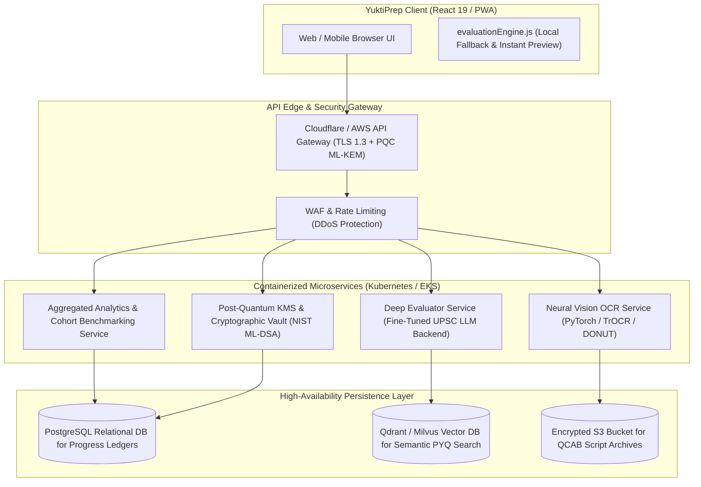

# YuktiPrep Mains 360° — Deployment, Operations & Cloud Integration Guide

**Document Code:** YUKTI-OPS-DEPLOY-2026  
**Version:** 2026.1  
**Classification:** DevOps, SRE & Operations Manual  

---

## 1. Local Development Setup & Quickstart

### 1.1 Prerequisites
- **Node.js:** `>= 18.0.0` (Node 20 or 22 LTS recommended)
- **Package Manager:** `npm` (bundled with Node) or `pnpm` / `yarn`
- **Modern Browser:** Chrome 120+, Firefox 120+, Safari 17+, Edge 120+ (supports modern ES Modules and CSS Variables)

### 1.2 Installation & Startup
```bash
# Clone or navigate to the project directory
cd "yuktiprep-mains"

# Install dependencies
npm install

# Start local development server with Hot Module Replacement (HMR)
npm run dev
```

The development server will bind to `http://localhost:5173/` by default.

---

## 2. Production Build & Static Asset Optimization

```bash
# Execute production bundle build via Vite
npm run build

# Preview the production bundle locally
npm run preview
```

### Build Output Directory (`/dist`):
- `index.html`: Optimized HTML entry point with preloaded assets.
- `assets/*.js`: Code-split, minified ES module chunks.
- `assets/*.css`: Purged and minified production stylesheets.

---

## 3. Code Quality, Linting & Validation

YuktiPrep Mains 360° utilizes **Oxlint**, a high-performance Rust-based linter for React and JavaScript:

```bash
# Run Oxlint across all source files
npm run lint
```

---

## 4. Cloud Integration & Future Microservices Architecture

While YuktiPrep Mains 360° functions as an autonomous, zero-latency client-side application, it is designed for seamless integration with enterprise cloud microservices:



---

## 5. Environment Configuration Variables

For production cloud deployments, configure the following environment parameters in `.env`:

```ini
# Application Mode
VITE_APP_ENV=production
VITE_APP_VERSION=2026.1

# Quantum-Ready Cryptography Flags
VITE_ENABLE_PQC_ENCRYPTION=true
VITE_PQC_KEM_ALGORITHM=ML-KEM-768
VITE_PQC_SIGNATURE_ALGORITHM=ML-DSA-65

# External Microservices Endpoints (Optional)
VITE_API_BASE_URL=https://api.yuktiprep.com/v1
VITE_OCR_SERVICE_URL=https://vision.yuktiprep.com/ocr
VITE_EVALUATION_SERVICE_URL=https://eval.yuktiprep.com/mains360

# Telemetry & Observability (Anonymized)
VITE_TELEMETRY_ENABLED=false
```

---

## 6. Observability, Metrics & Health Probes

1. **Frontend Latency:** Track Core Web Vitals (LCP `< 1.2s`, FID `< 50ms`, CLS `< 0.05`).
2. **Evaluation Compute Time:** Log client evaluation time to ensure deterministic sub-50ms execution.
3. **OCR Processing Time:** Monitor simulated/cloud neural scan duration (target `< 1.5s` per QCAB page).
4. **Error Boundaries:** React Error Boundaries capture unexpected rendering faults and gracefully fallback to the studio workspace.
