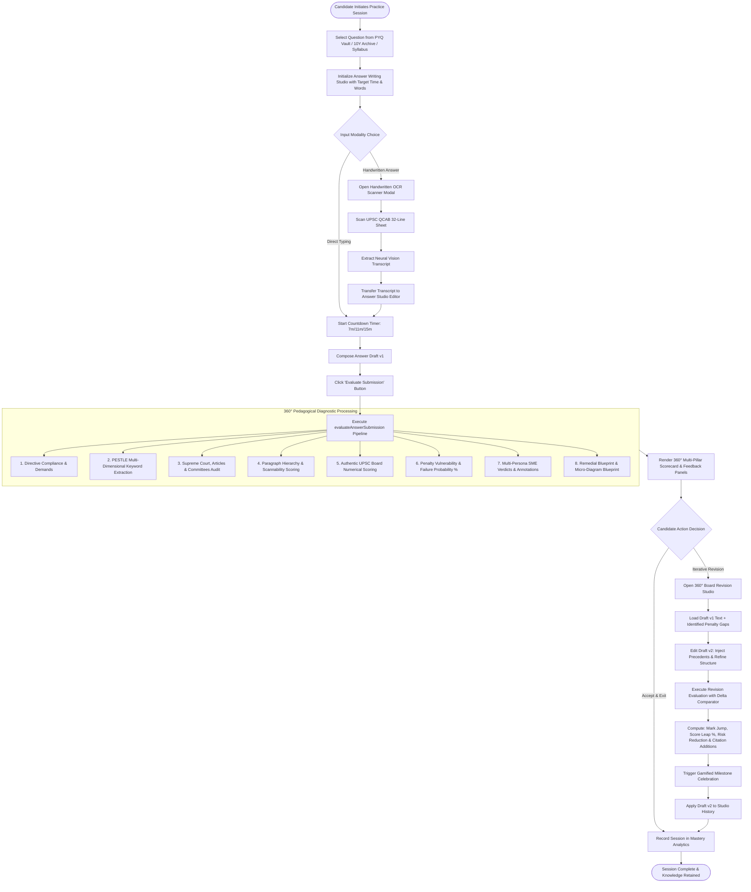
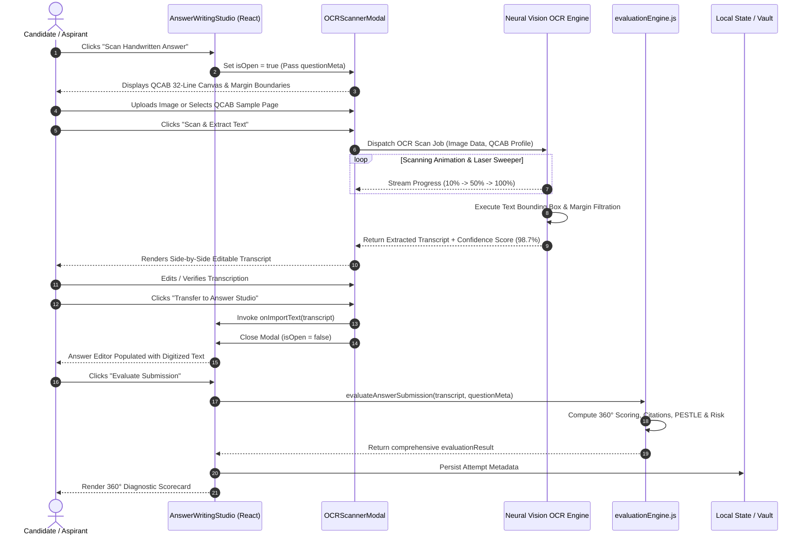
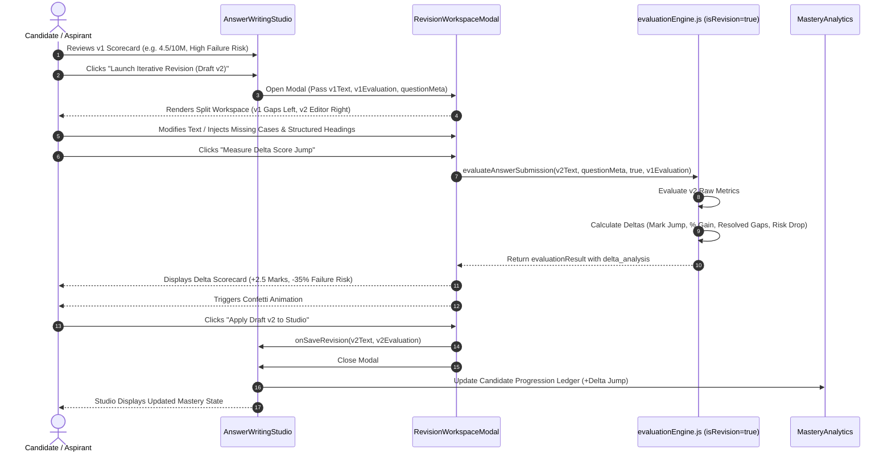
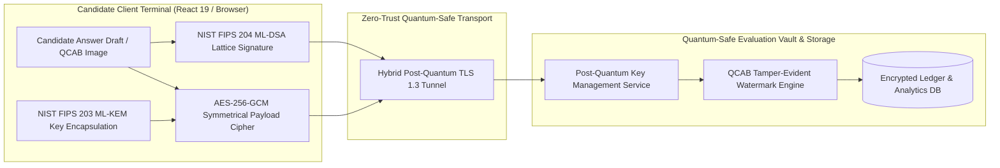
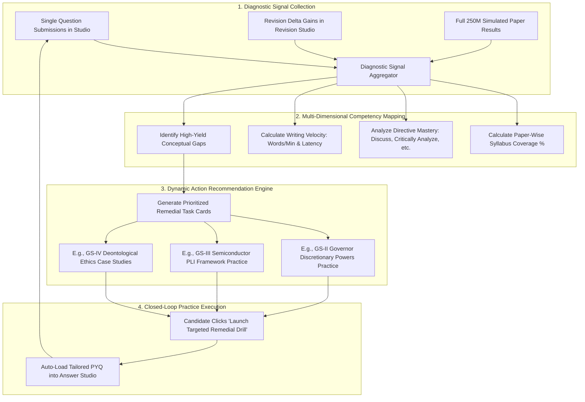

# YuktiPrep Mains 360° — Integration Flows, Sequence Diagrams & Flowcharts

**Document Code:** YUKTI-INT-FLOW-2026  
**Version:** 2026.1  
**Classification:** Technical Specification & System Integrations  

---

## 1. System Integration Overview

The YuktiPrep Mains 360° platform integrates multiple decoupled modules into a cohesive pedagogical engine. This document specifies all inter-component integration flows, sequence lifecycles, and cryptographic pipelines using standard Mermaid diagrams and API contract schemas.

```
                                  +---------------------------------------+
                                  |     Candidate UI & Event Dispatch     |
                                  +-------------------+-------------------+
                                                      |
                                                      v
                                  +---------------------------------------+
                                  |     Unified Router & State Manager    |
                                  +---------+-------------------+---------+
                                            |                   |
                     +----------------------+                   +----------------------+
                     |                                                                 |
                     v                                                                 v
+-----------------------------------------+                       +-----------------------------------------+
|     Answer Writing & Simulator Flow     |                       |       Neural Vision OCR Ingestion       |
|  - Timed Writing Workspace              |                       |  - UPSC QCAB Margin Cropping            |
|  - Word Count & Format Sanitizer        |                       |  - OCR Bounding Box Extractor           |
+--------------------+--------------------+                       +--------------------+--------------------+
                     |                                                                 |
                     +----------------------+                   +----------------------+
                                            |                   |
                                            v                   v
                                  +---------------------------------------+
                                  |   360° Board Evaluation Engine Core   |
                                  |   (evaluationEngine.js Pipeline)      |
                                  +-------------------+-------------------+
                                                      |
                     +--------------------------------+--------------------------------+
                     |                                |                                |
                     v                                v                                v
+-------------------------+      +-------------------------+      +-------------------------+
|  Risk & Penalty Audits  |      |  Root-Cause Diagnostics |      | Multi-Persona SME Panel |
|  - Failure Prob %       |      |  - PESTLE Gaps          |      | - Lead Examiner Verdict |
|  - Directives Traps     |      |  - Missed Citations     |      | - Delta v1->v2 Tracker  |
+-------------------------+      +-------------------------+      +-------------------------+
```

---

## 2. End-to-End Answer Writing & Iterative Revision Flowchart

This flowchart illustrates the complete lifecycle of a candidate practicing a single question: from question selection, timed composition (or OCR upload), multi-criteria evaluation, to launching the revision workspace and tracking the delta improvement.



---

## 3. Sequence Diagram: Neural Vision OCR & Handwritten QCAB Ingestion

This sequence diagram details the exact event flow between the candidate, the UI layer, the OCR scanner modal, the neural vision engine, and the evaluation engine.



---

## 4. Sequence Diagram: 360° Iterative Revision Studio (Draft v1 → v2 Delta Tracker)



---

## 5. 3-Hour Full Paper Simulator Lifecycle Flowchart

This flowchart outlines how the 3-Hour (180 Minutes), 250-Mark, 20-Question simulation engine executes, manages real-time test state, and performs aggregate multi-question grading upon submission.

```mermaid
flowchart TD
    subgraph Sim_Initialization ["Simulation Phase 1: Test Initialization"]
        SimStart([Candidate Starts 3-Hour Full Mock]) --> SelectPaper[Select Paper: GS-I, GS-II, GS-III, GS-IV, or Optional]
        SelectPaper --> LoadPaperData[Load 20 Official Questions from fullPaperData.js]
        LoadPaperData --> InitClock[Initialize Master Clock: 180 Minutes / 10,800 Seconds]
        InitClock --> InitState[Initialize Question Palette: 1-10 Section A, 11-20 Section B]
    end

    subgraph Sim_Active_Exam ["Simulation Phase 2: Live Test Orchestration"]
        InitState --> ActiveTimer[Master Countdown Active]
        ActiveTimer --> DisplayCurrentQ[Display Active Question Card with Marks & Time Target]
        
        DisplayCurrentQ --> UserAction{Candidate Action}
        UserAction -->|Type Answer| UpdateAnswer[Update answers Map: answers[qId] = text]
        UserAction -->|Flag Question| ToggleFlag[Update flagged Map: flagged[qId] = !flagged[qId]]
        UserAction -->|Scan Handwritten| LaunchOCRModal[OCR Modal -> Import to Current Q]
        UserAction -->|Navigate Palette| SelectIndex[Set currentQIndex = targetIndex]
        
        UpdateAnswer --> AutoSaveBuffer[Continuous In-Memory State Sync]
        ToggleFlag --> AutoSaveBuffer
        LaunchOCRModal --> AutoSaveBuffer
        SelectIndex --> DisplayCurrentQ
        AutoSaveBuffer --> ActiveTimer
    end

    subgraph Sim_Termination ["Simulation Phase 3: Final Submission & Aggregate Board Evaluation"]
        ActiveTimer --> TimeExpires{Time Expired OR Manual Submit?}
        TimeExpires -->|Yes| HaltClock[Halt Master Timer]
        HaltClock --> BatchEval[Dispatch Batch Evaluation for All 20 Questions]
        
        BatchEval --> EvalLoop[Iterate through questions 1 to 20]
        EvalLoop --> EvalItem[Call evaluateAnswerSubmission for Each Answer]
        EvalItem --> Accumulate[Accumulate Section A Score, Section B Score, Total Marks & Percentile]
        
        Accumulate --> GenSimReport[Generate Full Paper Comprehensive Performance Report]
        GenSimReport --> RenderSummary[Render 250M Summary Dashboard with Question Breakdown]
        RenderSummary --> SyncAnalytics[Push Aggregated Score to Mastery Analytics]
        SyncAnalytics --> SimEnd([Simulation Concluded])
    end
```

---

## 6. Post-Quantum Cryptography (PQC) & Zero-Trust Security Pipeline

YuktiPrep Mains 360° incorporates a forward-looking quantum-ready cryptographic architecture designed to safeguard candidate intellectual property, examination papers, and evaluation transcripts against "Harvest Now, Decrypt Later" (HNDL) quantum threats.



### 6.1 Cryptographic Protocol Specifications
1. **Key Encapsulation Mechanism (KEM):** ML-KEM-768 (CRYSTALS-Kyber) for post-quantum symmetric key exchange.
2. **Digital Signatures (DSA):** ML-DSA-65 (CRYSTALS-Dilithium) for non-repudiation of submitted examination papers.
3. **Payload Encryption:** AES-256-GCM authenticated encryption for candidate answer payloads in local memory and storage.
4. **Zero-Knowledge Proofs (ZKP):** Anonymous score verification enabling candidates to prove percentile rankings without exposing raw answer text.

---

## 7. Mastery Analytics & Remedial Loop Flowchart



---

## 8. API & Data Contract Specifications

### 8.1 Answer Evaluation Request Payload (`EvaluationRequest`)
```json
{
  "$schema": "http://json-schema.org/draft-07/schema#",
  "title": "EvaluationRequest",
  "type": "object",
  "required": ["submissionText", "questionMeta"],
  "properties": {
    "submissionText": {
      "type": "string",
      "description": "Full text of candidate answer submission."
    },
    "questionMeta": {
      "type": "object",
      "required": ["id", "marks", "word_limit", "directive"],
      "properties": {
        "id": { "type": "string" },
        "paper_code": { "type": "string" },
        "topic_name": { "type": "string" },
        "marks": { "type": "integer", "enum": [10, 15, 20, 125, 250] },
        "word_limit": { "type": "integer" },
        "directive": { "type": "string" },
        "key_articles": { "type": "array", "items": { "type": "string" } },
        "model_framework": { "type": "object" }
      }
    },
    "isRevision": {
      "type": "boolean",
      "default": false
    },
    "previousEvaluation": {
      "type": "object",
      "description": "Nullable previous evaluation result for Draft v1 -> v2 delta calculation."
    }
  }
}
```

### 8.2 Answer Evaluation Result Payload (`EvaluationResult`)
```json
{
  "$schema": "http://json-schema.org/draft-07/schema#",
  "title": "EvaluationResult",
  "type": "object",
  "required": [
    "id",
    "timestamp",
    "word_count",
    "max_marks",
    "awarded_marks",
    "marks_percentage",
    "pillars_360",
    "risk_analysis",
    "root_cause_analysis",
    "remedial_blueprint",
    "sme_feedback"
  ],
  "properties": {
    "id": { "type": "string" },
    "timestamp": { "type": "string", "format": "date-time" },
    "is_revision": { "type": "boolean" },
    "word_count": { "type": "integer" },
    "target_words": { "type": "integer" },
    "max_marks": { "type": "number" },
    "awarded_marks": { "type": "number" },
    "marks_percentage": { "type": "integer" },
    "realism_band": { "type": "string" },
    "percentile_band": { "type": "string" },
    "pillars_360": {
      "type": "object",
      "properties": {
        "directive_precision": { "type": "integer" },
        "substantive_authority": { "type": "integer" },
        "multidimensional_pestle": { "type": "integer" },
        "examiner_impression_index": { "type": "integer" },
        "visual_scannability": { "type": "integer" },
        "visionary_synthesis": { "type": "integer" }
      }
    },
    "risk_analysis": {
      "type": "object",
      "properties": {
        "risk_level": { "type": "string" },
        "failure_probability_pct": { "type": "integer" },
        "vulnerabilities": {
          "type": "array",
          "items": {
            "type": "object",
            "properties": {
              "type": { "type": "string" },
              "severity": { "type": "string" },
              "impact": { "type": "string" },
              "description": { "type": "string" },
              "how_examiner_views_it": { "type": "string" }
            }
          }
        }
      }
    },
    "delta_analysis": {
      "type": "object",
      "properties": {
        "previous_marks": { "type": "number" },
        "new_marks": { "type": "number" },
        "mark_jump": { "type": "string" },
        "mark_jump_pct": { "type": "string" },
        "risk_reduction_pct": { "type": "string" },
        "resolved_dimensions": { "type": "array", "items": { "type": "string" } },
        "newly_added_citations": { "type": "array", "items": { "type": "string" } }
      }
    }
  }
}
```
