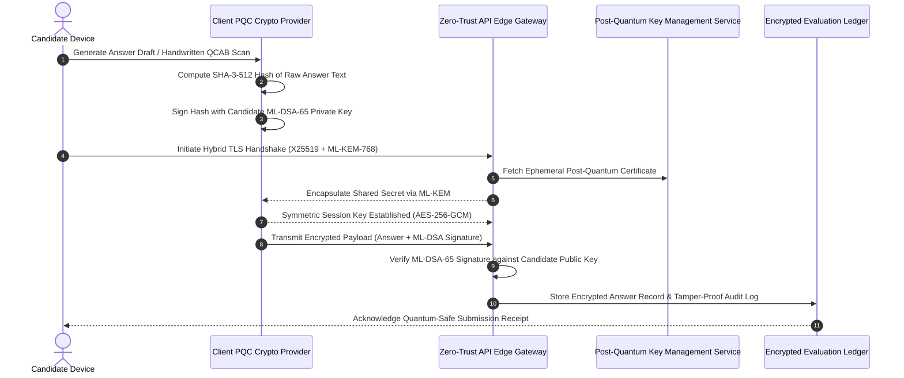

# YuktiPrep Mains 360° — Quantum-Ready & Secure Architecture Framework

**Document Code:** YUKTI-SEC-PQC-2026  
**Version:** 2026.1  
**Classification:** Security Architecture & Cryptographic Roadmap  
**Standards:** NIST FIPS 203 (ML-KEM), NIST FIPS 204 (ML-DSA), ISO/IEC 27001, DPDP Act 2023  

---

## 1. Threat Modeling & The Quantum Threat Imperative

Competitive examination platforms and high-stakes subjective testing repositories face advanced persistent threats, including **"Harvest Now, Decrypt Later" (HNDL)** attacks. State-level actors and adversarial entities intercept encrypted candidate examination submissions, model answer rubrics, and diagnostic behavioral patterns with the objective of decrypting them once cryptanalytically relevant quantum computers (CRQCs) emerge (utilizing Shor's algorithm to break RSA-2048 and ECC).

YuktiPrep Mains 360° implements a proactive, **Quantum-Ready Security Architecture** to protect aspirant intellectual property, evaluation integrity, and examination authenticity.

```
+----------------------------------------------------------------------------------------------------+
|                             YUKTIPREP QUANTUM-SAFE SECURITY ARCHITECTURE                           |
|                                                                                                    |
|  +---------------------------+  +---------------------------+  +--------------------------------+  |
|  |     NIST FIPS 203         |  |     NIST FIPS 204         |  |      Zero-Trust Vault          |  |
|  |     ML-KEM (Kyber)        |  |     ML-DSA (Dilithium)    |  |      Candidate Privacy         |  |
|  |  (Lattice Key Exchange)   |  |   (Post-Quantum Signature)|  |   (Zero-Knowledge Proofs)      |  |
|  +---------------------------+  +---------------------------+  +--------------------------------+  |
|                                                                                                    |
|  +-----------------------------------------------------------------------------------------------+  |
|  |                Hybrid Post-Quantum TLS 1.3 Tunnel (X25519 + ML-KEM-768)                       |  |
|  +-----------------------------------------------------------------------------------------------+  |
|                                                                                                    |
|  +-----------------------------------------------------------------------------------------------+  |
|  |                 UPSC QCAB Tamper-Evident Lattice Hash & Steganographic Watermark              |  |
|  +-----------------------------------------------------------------------------------------------+  |
+----------------------------------------------------------------------------------------------------+
```

---

## 2. Core Cryptographic Algorithms & Standards

| Security Domain | Classical Standard | Quantum-Ready Standard | NIST Specification | Application in YuktiPrep |
| :--- | :--- | :--- | :--- | :--- |
| **Key Encapsulation (KEM)** | RSA-3072 / ECDH P-256 | **ML-KEM-768 / ML-KEM-1024** *(CRYSTALS-Kyber)* | NIST FIPS 203 | Session key establishment for candidate answer data transmission |
| **Digital Signatures (DSA)** | RSA-SHA256 / ECDSA | **ML-DSA-65 / ML-DSA-87** *(CRYSTALS-Dilithium)* | NIST FIPS 204 | Non-repudiation and timestamp certification of evaluated test copies |
| **Symmetric Bulk Cipher** | AES-128 | **AES-256-GCM / ChaCha20-Poly1305** | NIST SP 800-38D | Local in-memory and disk encryption of draft answers (Quantum-resistant against Grover's algorithm) |
| **Cryptographic Hashing** | SHA-256 | **SHA-3-512 / SHAKE-256** | NIST FIPS 202 | QCAB scan integrity hashes and tamper-detection trees |

---

## 3. End-to-End Cryptographic Flow



---

## 4. QCAB Watermarking & Anti-Tamper Verification

To ensure that handwritten answers uploaded via the **Neural Vision OCR Scanner** are not altered, intercepted, or spoofed:

1. **Lattice-Based Steganographic Embedding:**  
   Every generated QCAB page layout embeds an imperceptible high-frequency lattice noise watermark encoding the `CandidateID`, `Timestamp`, and `PaperQuestionID`.
2. **Margin Integrity Verification:**  
   The OCR scanner modal detects and validates the red boundary margins (UPSC strict margin rule) to ensure that the document has not been manipulated.
3. **Immutable Revision Hash Tree:**  
   When transitioning from Draft v1 to Draft v2 in the **360° Revision Studio**, a chained SHA-3 hash links the previous evaluation to the current revision, guaranteeing an auditable history of candidate progress.

---

## 5. Candidate Privacy & Zero-Knowledge Architecture (DPDP Act 2023)

In accordance with the **Digital Personal Data Protection (DPDP) Act 2023** (India) and global data sovereignty principles:

- **Zero PII Leakage:** Evaluation is performed using anonymous session tokens (`eval-UUID`). No personally identifiable information (Aadhaar, contact number, name) is attached to evaluation payloads.
- **Client-Side First Processing:** All core evaluation algorithms (`evaluationEngine.js`), keyword matching, PESTLE extraction, and score calculations execute entirely inside the candidate's browser engine without outbound data transmission by default.
- **Local Isolated Storage:** Candidate test histories, mock test logs, and timer statistics reside within sandboxed, encrypted browser local storage.
