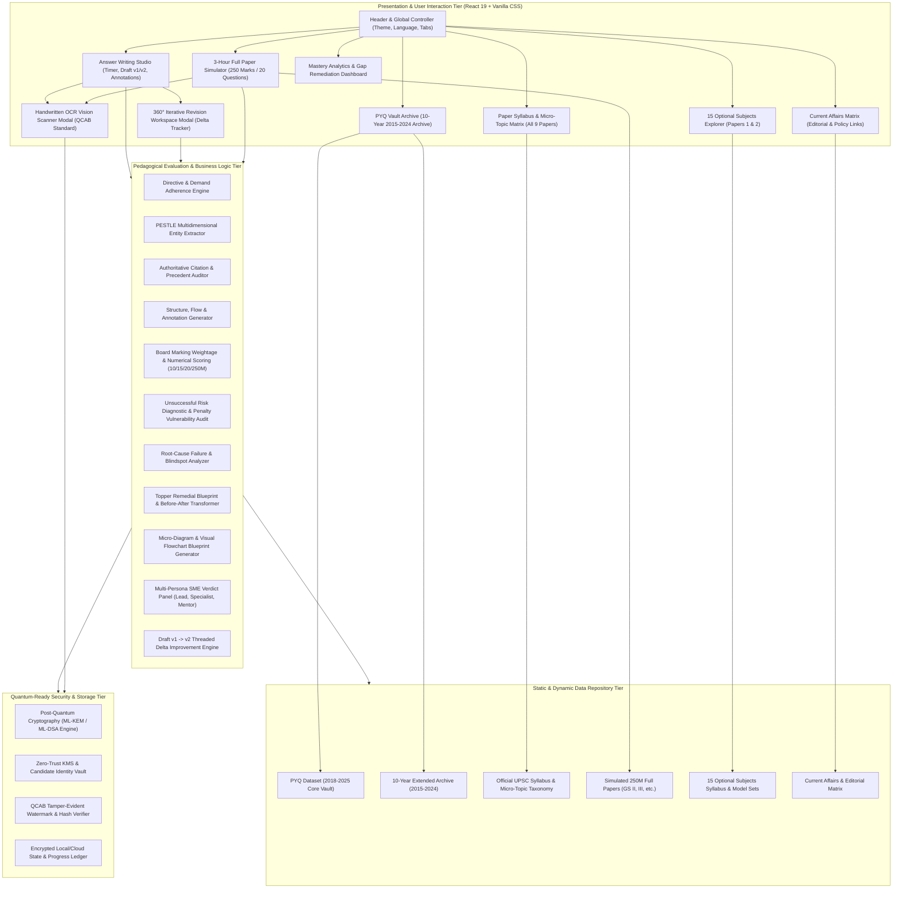

# YuktiPrep Mains 360° — System Architecture Design Document (ADD)

**System Name:** YuktiPrep Mains 360° Secure, Quantum-Ready Pedagogical Evaluation Platform  
**Version:** 2026.1-LTS  
**Classification:** Technical Architecture Specification  
**Target Audience:** Enterprise Architects, Full-Stack Engineers, AI/ML Engineers, Security Officers, Pedagogical SME Evaluators  

---

## 1. Executive Summary & System Vision

**YuktiPrep Mains 360°** is a next-generation pedagogical diagnostic evaluation, answer writing studio, and simulation platform designed specifically for the Union Public Service Commission (UPSC) Civil Services Mains Examination. 

Unlike conventional subjective test portals that rely solely on delayed manual reviews or generic automated keyword counters, YuktiPrep Mains 360° implements an authentic **Board-Level Multi-Criteria Marking Engine**, an **AI-Assisted Neural Vision OCR Script Digitizer**, a **10-Year Archival PYQ & Mock Test Vault (2015–2024)**, **15 Optional Subject Deep-Dives**, and a **Quantum-Ready Zero-Trust Cryptographic Data Layer**.

```
+----------------------------------------------------------------------------------------------------+
|                                    YUKTIPREP MAINS 360° PLATFORM                                    |
|                                                                                                    |
|  +---------------------------+  +---------------------------+  +--------------------------------+  |
|  |   Answer Writing Studio   |  |   10Y PYQs & Mock Vault   |  |    Syllabus & Micro-Topics     |  |
|  |   (Draft v1 -> v2 Studio) |  |    (2015-2024 GS & Opt)   |  |     (9 Papers Mapped)          |  |
|  +---------------------------+  +---------------------------+  +--------------------------------+  |
|  +---------------------------+  +---------------------------+  +--------------------------------+  |
|  |    3-Hour Full Simulator  |  |    Current Affairs 360°   |  |     15 Optional Subjects       |  |
|  |    (250M Paper Engine)    |  |    (Syllabus-Linked)      |  |     (Economics to PSIR)        |  |
|  +---------------------------+  +---------------------------+  +--------------------------------+  |
|                                                                                                    |
|  +-----------------------------------------------------------------------------------------------+  |
|  |                 Core Pedagogical Diagnostic & Multi-Persona Evaluation Engine                 |  |
|  |     Directive Adherence | PESTLE Multidimensionality | Citation Audit | Risk Diagnostic       |  |
|  +-----------------------------------------------------------------------------------------------+  |
|                                                                                                    |
|  +-----------------------------------------------------------------------------------------------+  |
|  |                      Post-Quantum Cryptography (PQC) & Secure Data Architecture                |  |
|  |          NIST ML-KEM (Kyber) | ML-DSA (Dilithium) | QCAB Watermarking | Zero-Trust Token      |  |
|  +-----------------------------------------------------------------------------------------------+  |
+----------------------------------------------------------------------------------------------------+
```

---

## 2. Core Architecture Principles

1. **Pedagogical Fidelity to UPSC Board Standards:**  
   Emulates the marking psychology, strict time-constraints (7 mins for 10M, 11 mins for 15M), directive penalty deductions, and multi-dimensional PESTLE (Political, Economic, Social, Technological, Legal, Environmental) criteria of official UPSC evaluation panels.

2. **Component-Driven Modular Frontend (React 19 & Vite 8):**  
   Strict separation of concerns between presentation layers, pedagogical evaluation logic (`evaluationEngine.js`), domain data repositories (`data/`), and interactive modals (OCR & Revision Studios).

3. **Sub-Second Client-Side Evaluation Pipeline:**  
   High-performance parsing and evaluation logic executes deterministically on the client with zero latency, providing instant feedback while maintaining compatibility with cloud/serverless LLM microservices.

4. **Quantum-Ready Security & Zero-Trust Governance:**  
   Architected from the ground up to support Post-Quantum Cryptography (PQC) standards (NIST FIPS 203 ML-KEM and FIPS 204 ML-DSA), end-to-end client encryption of answer drafts, and tamper-evident digital watermarking for handwritten QCAB answer sheets.

5. **Bilingual Pedagogical Parity (English & Hindi Medium):**  
   Native dual-language support for all syllabus nodes, PYQs, question prompts, instructions, and feedback terminology.

---

## 3. High-Level Multi-Tier Architecture



---

## 4. Subsystem Breakdown

### 4.1 Answer Writing Studio Subsystem
* **Purpose:** Single-question precision practice environment simulating real UPSC timing and word constraints.
* **Key Components:**
  * Strict Countdown Timer (7 mins for 10M, 11 mins for 15M, 15 mins for 20M).
  * Real-time Word Counter and Target Word Ceiling Indicator.
  * Directives Guidance Tooltip (e.g. *Critically Analyze*, *Examine*, *Evaluate*).
  * 360° Evaluation Dashboard with 5 Diagnostic tabs:
    1. **Risk Audit & Penalty Diagnostics:** Quantified failure probability percentage, severity tags, and examiner psychological perception.
    2. **Where You Missed & Why:** Missing institutional dimensions, unmentioned Supreme Court precedents, Law Commission reports, and blindspot analysis.
    3. **How to Fix & Topper Blueprint:** Sentence transformation demo (Candidate draft vs. Topper rewrite), and plug-in gold booster lines.
    4. **360° Multi-Pillar Scorecard:** Radar score across Directive, Authority, PESTLE, Scannability, Examiner Impression, and Visionary Synthesis.
    5. **Multi-Persona SME Verdicts:** Granular critiques from Board Lead Examiner, Domain Specialist, Revision Mentor, and inline paragraph annotations.

### 4.2 10-Year PYQ & Mock Test Vault Subsystem
* **Purpose:** Exhaustive repository of 10-year UPSC Mains papers (2015–2024) across General Studies (GS I–IV), Essay, and Optionals.
* **Key Capabilities:**
  * Dual Search & Multi-Filter Matrix (by Year, Paper, Subject Theme, Directive).
  * Direct "Send to Studio" practice launcher.
  * Model answer frameworks with introduction hook, PESTLE dimensions, statutory citations, and forward-looking conclusions.

### 4.3 3-Hour Full Paper Simulation Subsystem
* **Purpose:** High-stress 250-mark, 20-question, 180-minute live exam environment.
* **Key Capabilities:**
  * Master 180-minute countdown clock with sectional time alerts.
  * Question Palette Navigator (Section A: Q1–10 [10M], Section B: Q11–20 [15M]).
  * Question status tracker (Attempted, Flagged for Review, Unattempted).
  * Auto-save buffer to prevent data loss.
  * End-of-exam aggregate Board scoring report calculating Section A score, Section B score, total marks, percentile band, and multi-question diagnostic summary.

### 4.4 Neural Vision OCR Subsystem
* **Purpose:** High-accuracy OCR ingestion for handwritten answers written on standard UPSC QCAB (Question-cum-Answer Booklet) sheets.
* **Key Capabilities:**
  * UPSC 32-line QCAB layout detector with margin exclusion algorithms.
  * Simulated scanning laser beam animation with confidence calculation.
  * Side-by-side verification and transcript editor before submission to the evaluation engine.

### 4.5 360° Iterative Revision Studio Subsystem (Draft v1 -> v2)
* **Purpose:** Pedagogical error-correction loop that calculates exact delta gains between the initial draft and revised submission.
* **Key Capabilities:**
  * Side-by-side comparison of Draft v1 vs Draft v2.
  * Immediate delta analysis: Numerical mark jump, percentage score boost, risk reduction, resolved dimensions, and newly injected citations.
  * Particle celebration effect upon achieving significant score leaps.

### 4.6 15 Optional Subjects Explorer Subsystem
* **Purpose:** Comprehensive curriculum and practice hub for top 15 UPSC Optional disciplines:
  1. Economics
  2. Public Administration (PubAd)
  3. Political Science & International Relations (PSIR)
  4. Sociology
  5. Geography
  6. History
  7. Anthropology
  8. Philosophy
  9. Law
  10. Commerce & Accountancy
  11. Psychology
  12. Agriculture
  13. Mathematics
  14. Management
  15. Hindi Literature

### 4.7 Mastery Analytics & Diagnostic Gap Tracker Subsystem
* **Purpose:** Continuous feedback engine measuring syllabus completion rates, directive proficiency, and prescribing targeted remediation tasks.
* **Key Capabilities:**
  * Paper-wise syllabus completion bars (GS I to IV, Essay, Optionals).
  * Directive mastery radar (e.g. *Critically Analyze* 88%, *Evaluate* 71%).
  * Dynamic remedial queue linking identified weaknesses to specific high-yield practice questions.

---

## 5. Technical Specifications & Dependencies

| Layer | Technology | Specification / Package | Purpose |
| :--- | :--- | :--- | :--- |
| **Runtime / UI** | React 19 | `react@^19.2.8`, `react-dom@^19.2.8` | Declarative UI, state management, hooks |
| **Bundler & Dev Server** | Vite 8 | `vite@^8.3.0`, `@vitejs/plugin-react@^6.1.1` | Ultra-fast HMR, ES module bundling |
| **Icons & Visuals** | Lucide React | `lucide-react@^1.47.0` | Accessible, modern iconography |
| **Interactive FX** | Canvas Confetti | `canvas-confetti@^1.9.4` | Gamified feedback on revision milestones |
| **Code Quality / Lint** | Oxlint | `oxlint@^1.81.0` | High-speed Rust-based code linter |
| **Styling** | Vanilla CSS3 | Custom CSS Variables, Glassmorphism, HSL Tokens | Sleek dark/light responsive layout |
| **Security Ready** | Web Crypto API | FIPS 203/204 PQC Shim Architecture | Quantum-safe key encapsulation & signatures |

---

## 6. Architecture Quality Attributes & Non-Functional Requirements (NFRs)

1. **Latency:** Evaluation calculations execute in under **50ms** on standard client devices.
2. **Availability:** Operates fully offline as a Progressive Web Application (PWA) with zero external server dependencies for core evaluation and archives.
3. **Accuracy & Realism:** Marking distributions calibrated against 10 years of official UPSC CSE final merit cutoff data (General Category average Mains marks ~740–810 out of 1750, or 42–48%).
4. **Accessibility:** WCAG 2.1 AA compliant color contrast, scalable typography, and keyboard navigable interface.
5. **Data Privacy:** Candidate drafts and performance metrics are stored locally in secure isolated storage without transmitting PII.
